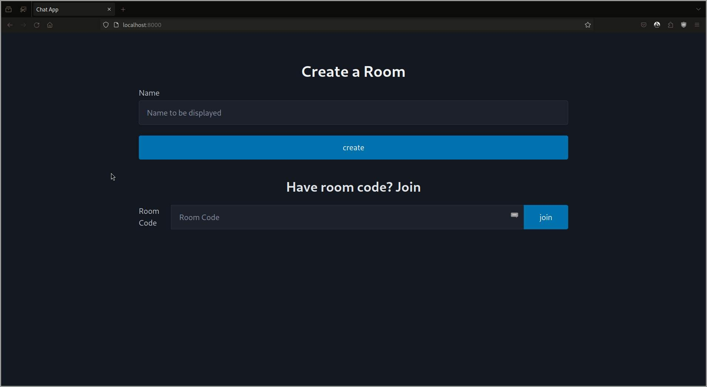

<h1 align="center">Flask Chat App</h1>

> A basic real time chat app written in flask and flask-socket.io.
 You can join a conversation by creating a room, and share the code with other participants who wants to join the conversation and all set.

## Todos

```
1. Chat Persistency
2. User Authentication
```

## ✨ Demo

<p align="center">
    
    
    
</p>

## 🚀 Usage

If you have docker compose installed, Just run the following command:

```sh
docker compose up
```

Or use the virtual environment and install all the required dependencies:

```sh
python3 -m venv venv
source venv/bin/activate
pip install -r requirements.txt
export FLASK_APP=app.main:app
flask run --host 0.0.0.0 --port 8000
```

    